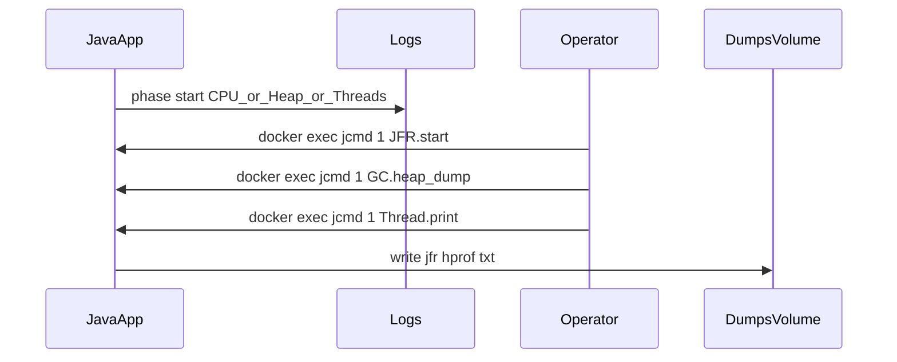

# Тестовый Java-сервис в Docker и снятие дампов

## Цель

Минимальный сервис, который **по расписанию или по HTTP** переключает «режимы» нагрузки (больше CPU, памяти, потоков), **пишет в лог** текущую фазу и метрики, и при этом удобно **снимать JFR, heap и thread dump** с запущенного контейнера.

## Реализация сервиса (рекомендуемый минимум)

- **Стек**: Java 17 или 21, **Maven** или **Gradle**, по желанию **Spring Boot 3** (удобны Actuator `/actuator/health`, опционально `/actuator/metrics`) — либо чистый `main` + `HttpServer`/`Javalin`, если хотите меньше зависимостей.
- **Управляемая нагрузка** (в отдельном пакете, например `load`):
  - **CPU**: цикл вычислений (например, хеши/простые операции) на заданное время или до флага; опционально `ForkJoinPool` для нескольких ядер.
  - **Память**: периодически аллоцировать `byte[]` заданного размера и держать ссылки в `List` с ограничением (чтобы не убить хост); фазы «рост кучи / освобождение».
  - **Потоки**: пул или набор «живых» потоков с `Thread.sleep` + лёгкая работа — полезно для thread dump.
- **Логи**: SLF4J + Logback; в каждой фазе логировать **имя фазы, целевые параметры** (мс, МБ, число потоков), **память кучи** (`Runtime.getRuntime().freeMemory/totalMemory` или `MemoryMXBean`), при желании **потоки** (`ThreadMXBean`).
- **Триггеры**: бесконечный цикл в `ScheduledExecutorService` (например, 30 с лёгкая нагрузка → 60 с тяжёлая → пауза) **или** REST: `POST /load/cpu?ms=5000`, `POST /load/memory?mb=200`, `POST /load/threads?n=50` — так проще синхронизировать дамп с нужной фазой.

Идея: **предсказуемые фазы** в логах упрощают сопоставление записи JFR/heap/thread с поведением процесса.

## Docker-образ

- Базовый образ: **Eclipse Temurin** или **Amazon Corretto** с тегом **JDK** (не JRE), чтобы в контейнере были `jcmd`, `jmap`, `jstack` той же версии, что и рантайм приложения.
- Точка входа: один процесс **Java как PID 1** (обычный `ENTRYPOINT` без лишней оболочки, либо `exec java ...` в скрипте) — тогда `**jcmd 1 ...`** стабильно указывает на JVM.
- **Том для дампов**: смонтировать volume на каталог вроде `/dumps`, а в JVM задать пути дампов туда же (см. ниже).
- Для отладки на некоторых хостах при необходимости: флаг `--cap-add=SYS_PTRACE` (если attach/инструменты жалуются); в проде это редко нужно, для локального теста иногда помогает.

## JVM-флаги (базовый набор под ваш сценарий)

- Явный размер кучи, чтобы поведение было воспроизводимым, например: `-Xms256m -Xmx512m` (подберите под хост).
- **Heap при OOM** (опционально): `-XX:+HeapDumpOnOutOfMemoryError -XX:HeapDumpPath=/dumps/heap-oom.hprof`.
- **JFR** можно не включать постоянно, а стартовать по `jcmd` (ниже); либо стартовая запись: `-XX:StartFlightRecording=...` — удобно для «сняли контейнер — уже есть запись», но файл нужно копировать из volume.

## Как снять дампы с контейнера

Предположение: контейнер запущен, Java — **PID 1**, в образе есть **JDK** из той же линейки, что и приложение.

### Thread dump

- Предпочтительно:  
`docker exec <container> jcmd 1 Thread.print`  
Вывод перенаправить в файл на хосте или:  
`docker exec <container> sh -c 'jcmd 1 Thread.print > /dumps/thread-$(date +%s).txt'`
- Альтернатива: `docker exec <container> jstack 1` (аналогично).
- Ещё вариант: `kill -3` к PID 1 на стороне контейнера — дамп уйдёт в stdout JVM (удобно если логи собираются в файл/ELK); с `jcmd` обычно проще.

### Heap dump (HPROF)

- `docker exec <container> jcmd 1 GC.heap_dump /dumps/heap.hprof`  
Файл появится в смонтированном volume → `docker cp` не обязателен, если volume уже на хосте.
- Убедиться, что на диске достаточно места (дамп ≈ размеру живых объектов в куче, часто сотни МБ).

### JFR (Java Flight Recorder)

- Разовая запись (пример):  
`docker exec <container> jcmd 1 JFR.start name=rec1 duration=60s filename=/dumps/rec1.jfr`  
По окончании файл в `/dumps`.
- Или старт без автостопа и потом dump:  
`jcmd 1 JFR.start name=rec2` → по готовности `jcmd 1 JFR.dump name=rec2 filename=/dumps/rec2.jfr` → `jcmd 1 JFR.stop name=rec2`.
- Открытие: **JDK Mission Control** (JMC) локально, файл `.jfr`.

## Связка «фаза в логах ↔ дамп»

1. По логам видите, что началась фаза «heavy memory».
2. Запускаете `JFR.start` с `duration` на эту фазу или делаете `GC.heap_dump` в конце фазы.
3. Thread dump снимаете в момент, когда в логах видно активные потоки нагрузки.

## Что не смешивать

- **Не полагаться на `jcmd` из другой major-версии JDK** на хосте против JVM в контейнере — выполняйте `jcmd` **внутри** контейнера.
- **Alpine + musl**: возможны нюансы с JVM и инструментами; для учебного/тестового образа чаще проще **Debian/Ubuntu-based Temurin**.

## Если позже понадобится в Kubernetes

Тот же `kubectl exec -it pod -- jcmd 1 ...`; volume — `emptyDir` или PVC для `/dumps`; ограничения `securityContext` могут запретить часть операций — тогда отдельный debug-под с тем же образом реже нужен, если `jcmd` вызывается внутри того же контейнера, где крутится JVM.

---

**Итог**: делайте небольшой сервис с **явными фазами нагрузки и логами**, Docker на **JDK-образе**, **volume `/dumps`**, PID 1 = `java`, дампы через `**jcmd 1**` (JFR / `GC.heap_dump` / `Thread.print`). Это самый прямой путь без привязки к конкретному оркестратору.